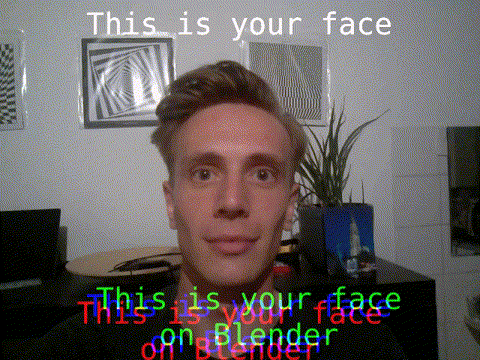

# These are some experiments

They are just to explore some of the possibilities of collor shifted effects.
Either transformed in location or time.

# Warped Time Record

This is a video of a record being played on a turntable, with independent,
varying, non linear, playback speeds per color-channel.

## What this is

The following table gives each significant timepoint, and the event at said point, and the playback speeds for each channel at that point.

| Time    | Event                      | Speed Red | Speed Green | Speed Blue |
|:--------|:---------------------------|:----------|:------------|:-----------|
| t0      | Video start                | 1         | 1           | 1          |
| t1      | Channels G and B slow down | 1         | [1/2, 1]    | [1/3, 1]   |
| (t1,t2) | Phases shift               | 1         | 1/2         | 1/3        |
| t2      | Channels G and B speed up  | 1         | [1/2, 1]    | [1/3, 1]   |
| t3      | Video ends                 | 1         | 1           | 1          |

The following graph shows the phase for each of the 3 RGB channels in radians, with the timepoints denoted.

# Text shift diagonal

This is pretty straight forward:

